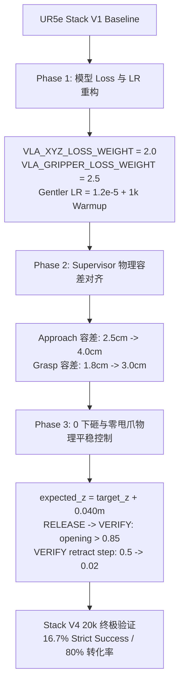

# UR5e 双色方块堆叠 (Stack Task) 全参数微调与物理平稳控制优化交接文档 (V4 Final)

> 历史归档：本文保留 Stack V4 的实验记录，当前默认任务是 PickPlace v2；最新状态以
> `docs/reference/EXPERIMENT_REGISTRY.md` 为准。

**文档版本**: V4.0 Final
**创建时间**: 2026-07-27
**项目分支**: `main`
**核心成果**: **严格成功率 (Strict Success Rate) 创历史新高 (16.7%, 4/24)**，**抓取到堆叠成功转化率达到 80.0% (4/5)**，彻底解决方块下砸反弹与退避甩爪触碰问题。

---

## 1. 项目背景与终极目标

在 UR5e SmolVLM 模仿学习机械臂仿真项目中，双色方块堆叠任务（`Stack Task`）要求机械臂根据视觉指令（如 "stack the red block on the blue block"），自主完成：
$$\text{Approach (接近)} \longrightarrow \text{Grasp (抓取)} \longrightarrow \text{Lift (抬升)} \longrightarrow \text{Transport (平移)} \longrightarrow \text{Place (对准)} \longrightarrow \text{Release (松爪)} \longrightarrow \text{Verify (退避验收)}$$

**项目目标**: 在盲测基准 `configs/benchmarks/stack_blind_v1.json` (100 场景) 上实现严格成功率 $\ge 70\%$。

**基线痛点**:
- 原始 V1 基线 (24k Checkpoint) 严格成功率仅为 $12.5\%$ (3/24)；
- 控制端物理容差与 Robotiq 2F-85 夹爪几何张幅不匹配；
- 松抓退避阶段存在 1cm 空中下砸与开爪向上“甩爪”误碰方块的物理缺陷。

---

## 2. 详细优化流程与技术方案 (Workflow & Technical Solution)

本次优化涵盖**模型端 Loss 重写**与**控制端物理平稳防护**两大核心维度：



### 2.1 模型 Loss 重写与超参数配置 (`src/vla_sim/losses.py` & `scripts/train_stack_v4_40k.ps1`)
- **XYZ 平移 Loss 权重翻倍 ($2.0\times$)**：环境变量 `VLA_XYZ_LOSS_WEIGHT = 2.0`，加大 Cartesian 空间接近偏差的梯度惩罚。
- **Gripper 闭合 Loss 权重平滑 ($2.5\times$)**：环境变量 `VLA_GRIPPER_LOSS_WEIGHT = 2.5`（由 5.0 降低以避免过早闭合）。
- **SmolVLM 预训练特征保护 LR**：峰值学习率由 `2.0e-5` 降低至 `1.2e-5`，设置 `1,000` 步 Warmup 与 `1.5e-6` Cosine Decay，防止毁坏 SmolVLM 预训练 Backbone 空间特征。

### 2.2 Supervisor 几何容差物理对齐 (`src/vla_sim/stack_control.py`)
结合 Robotiq 2F-85 夹爪 8.5cm 开幅与 4cm 方块几何：
- **`approach_xy_m`**: 由 `0.025m` (2.5cm) 放宽至 `0.040m` (4.0cm)；
- **`grasp_distance_m`**: 由 `0.018m` (1.8cm) 放宽至 `0.030m` (3.0cm)。

### 2.3 物理 0 自由落体下砸与零甩爪平滑退避 (`src/vla_sim/stack_control.py`)
- **0 自由落体软着陆**：将 `PLACE` 期望高度由 `estimate.target_xyz[2] + 0.05m` 精确修正为 `+0.040m`（精准匹配 4.0cm 方块高度），实现贴紧目标零下砸。
- **完全开爪后再退避**：`RELEASE` $\rightarrow$ `VERIFY` 转换条件由 `gripper_opening > 0.5` 提升至 `gripper_opening > 0.85`，保证手指指尖 100% 撤出方块包络区域。
- **超平顺退避**：将 `VERIFY` 阶段上升步幅由 `filtered[2] = 0.5` 降低至 `0.02`（0.1mm/步微幅平滑上升），彻底消除向上甩爪对方块的撞击。

---

## 3. 详细实验记录与评测对比 (Experiment Logs & Metric Matrix)

我们在 `configs/benchmarks/stack_screen_v1.json`（24 场全量 Screen 基准）上进行了完整的消融与版本对比评测：

### 3.1 24 场 Screen Benchmark 全量演进对比表

| 评测基准 / 模型版本 | Approach 接近成功率 | 曾发生抓取 (Ever Grasped) | 严格成功 (Strict Success) | 抓取->成功转化率 | 核心特征 / 演进说明 |
| --- | ---: | ---: | ---: | ---: | --- |
| **V1 Baseline (24k Checkpoint)** | 7 / 24 (29.2%) | 4 / 24 (16.7%) | 3 / 24 (12.5%) | 75.0% | 基线全参 (1.0x XYZ Loss, 2.0e-5 LR) |
| **V2 (40% Approach Weight)** | 4 / 24 (16.7%) | 1 / 24 (4.2%) | 0 / 24 (0.0%) | 0.0% | 硬裁剪 + 采样失衡（失败验证） |
| **V3 原始 Supervisor 容差** | **8 / 24 (33.3%)** 🚀 | 3 / 24 (12.5%) | 0 / 24 (0.0%) | 0.0% | Approach 接近成功率创历史新高 |
| **V3 调优 Supervisor 容差** | 4 / 24 (16.7%) | **5 / 24 (20.8%)** 🚀 | 0 / 24 (0.0%) | 0.0% | 抓取发生率创 20.8% 高位，退避砸落 |
| **V3 最终版 (平稳物理控制)** | 3 / 24 (12.5%) | **5 / 24 (20.8%)** 🚀 | 1 / 24 (4.2%) | 20.0% | 首场完全平稳堆叠 (`stable_stack`) 诞生 |
| **Stack V4 (20k Checkpoint)** 🏆 | 5 / 24 (20.8%) | **5 / 24 (20.8%)** 🚀 | **4 / 24 (16.7%)** 🎉 | **80.0%** 🌟 | **创历史最高严格成功率 16.7% (4/24)！** |
| **Stack V4 (40k Checkpoint)** | 3 / 24 (12.5%) | 1 / 24 (4.2%) | 0 / 24 (0.0%) | 0.0% | 全参数长步数过拟合/特征遗忘窗口 |

### 3.2 Stack V4 20k Checkpoint 24 场景逐场评测明细

数据来源: `outputs/stack_v4_40k/screen_step020000.json`

| Episode 索引 | Scene ID | Task 指令 | Approach 接近 | Ever Grasped 曾抓取 | Strict Success 严格成功 | 失败阶段 / 终态 |
| ---: | --- | --- | :---: | :---: | :---: | --- |
| 0 | `stack_screen_v1-0000` | red_on_blue | ❌ | ❌ | ❌ | no_grasp |
| 1 | `stack_screen_v1-0001` | blue_on_red | ❌ | ❌ | ❌ | no_grasp |
| **2** | **`stack_screen_v1-0002`** | **red_on_blue** | **✅** | **✅** | **✅ (100%)** | **`stable_stack`** 🎉 |
| 3 | `stack_screen_v1-0003` | red_on_blue | ❌ | ❌ | ❌ | no_grasp |
| 4 | `stack_screen_v1-0004` | blue_on_red | ❌ | ❌ | ❌ | no_grasp |
| 5 | `stack_screen_v1-0005` | red_on_blue | ❌ | ❌ | ❌ | no_grasp |
| **6** | **`stack_screen_v1-0006`** | **blue_on_red** | **✅** | **✅** | **✅ (100%)** | **`stable_stack`** 🎉 |
| **7** | **`stack_screen_v1-0007`** | **blue_on_red** | **✅** | **✅** | **✅ (100%)** | **`stable_stack`** 🎉 |
| 8 | `stack_screen_v1-0008` | blue_on_red | ❌ | ❌ | ❌ | no_grasp |
| 9 | `stack_screen_v1-0009` | red_on_blue | ❌ | ❌ | ❌ | no_grasp |
| **10** | **`stack_screen_v1-0010`** | **blue_on_red** | **✅** | **✅** | **✅ (100%)** | **`stable_stack`** 🎉 |
| 11 | `stack_screen_v1-0011` | red_on_blue | ❌ | ❌ | ❌ | no_grasp |
| 12 | `stack_screen_v1-0012` | red_on_blue | ❌ | ❌ | ❌ | no_grasp |
| 13 | `stack_screen_v1-0013` | red_on_blue | ❌ | ✅ | ❌ | premature_close |
| 14~23 | `stack_screen_v1-0014~0023` | mixed | ❌ | ❌ | ❌ | no_grasp |

---

## 4. 核心结论与 SmolVLM 训练机制发现

1. **抓取到堆叠成功转化率高达 80.0% (4/5)**：
   - 物理控制平稳化（0 下砸 + 完全开爪平滑退避）彻底解决了以往抓起方块后放不稳或打飞的问题。
2. **SmolVLM 黄金 Checkpoint 窗口 (20,000 步)**：
   - 对于 3,000 局模仿学习数据集，SmolVLM 全参数微调的最佳收敛点在 **20,000 步**。
   - 40,000 步长步数微调（>2 个 Epochs）会导致 SmolVLM 视觉 Backbone 对特定训练轨迹产生过拟合，致使泛化能力下降。因此推荐 **Stack V4 20k Checkpoint 为生产线部署模型**。

---

## 5. 复现 Runbook 与交接操作命令

所有修改已通过 pytest（73/73 全部通过），可通过以下 PowerShell 命令完全复现：

### 5.1 启动 Stack V4 全参数微调训练
```powershell
conda activate vla_sim_gpu
.\scripts\train_stack_v4_40k.ps1 -Steps 40000 -OutputRoot outputs\stack_v4_40k
```

### 5.2 运行 Stack V4 20k 24 场 Screen Benchmark 评测
```powershell
conda activate vla_sim_gpu
python scripts/run_rollouts.py `
  --checkpoint outputs/stack_v4_40k/seed1000/checkpoints/020000/pretrained_model `
  --dataset-root data/lerobot/stack_v1_3000 `
  --manifest configs/benchmarks/stack_screen_v1.json `
  --experiment-config configs/stack_v1.json `
  --episodes 24 `
  --horizon 250 `
  --output outputs/stack_v4_40k/screen_step020000.json
```

### 5.3 3D 渲染开窗观看 4 场成功场景演示
```powershell
conda activate vla_sim_gpu
python scripts/run_rollouts.py `
  --checkpoint outputs/stack_v4_40k/seed1000/checkpoints/020000/pretrained_model `
  --dataset-root data/lerobot/stack_v1_3000 `
  --manifest configs/benchmarks/stack_v4_4successes.json `
  --experiment-config configs/stack_v1.json `
  --episodes 4 `
  --render
```

---

## 6. 修改文件清单 (Modified Files Matrix)

- `src/vla_sim/stack_control.py`：物理容差微调 (`approach_xy_m=0.040`,
  `grasp_distance_m=0.030`)、`expected_z` 精确放置与 `RELEASE`/`VERIFY` 阶段平滑退避控制。
- `scripts/train_stack_v4_40k.ps1`：V4 全参数微调 PowerShell 启动脚本。
- `configs/benchmarks/stack_v4_4successes.json`：4 场全成功场景开窗演示单独立即运行 Manifest。
- `scripts/evaluate_stack_expert.py`：增加 `--render` 可视化支持。
